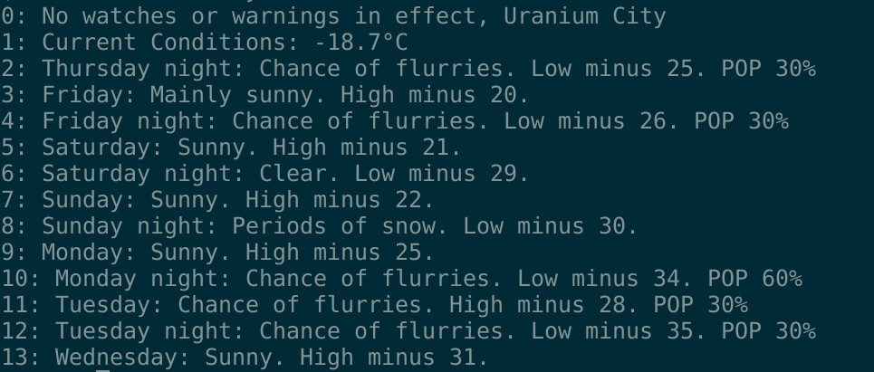

# WeatherOnConsole (woc) v 0.3

## Synopsis

woc is a terminal application that displays the weather forecast of 807 Canadian towns and cities with data provided by Environment Canada. 

## Options
 
woc \[city name\]

woc -l \(list cities\)

woc -d \[city name\] \(set default\)

## Files
.wocdb - comma-separated database file read by woc. Run woc-util.sh to generate an up-to-date list. 		
.wocdef - default city config file created after running woc -d \[city name\].

## Requirements

**Ubuntu Linux 15+:**
libxml2, libxml2-dev, libcurl3 and libcurl3-dev are required.

To compile:  
gcc woc.c -o woc -lcurl -lxml2 -lm -I/usr/include/libxml2

**OpenBSD 5.9:**
Ports Collection must be installed first. libxml2 and curl arerequired.

cd /usr/ports/textproc/libxml
make install

cd /usr/ports/net/curl
make install

Edit: /usr/local/include/libxml2/encoding.h
Update line including iconv.h to:
#include </usr/local/include/iconv.h>  

To compile:
gcc woc.c -o woc -L/usr/local/lib -lcurl -I/usr/local/include/ -lxml2 -lm -I/usr/local/include/libxml2

## Screenshot

## Examples
$./woc -l | grep otta

ottawa (kanata - orleans)

ottawa (richmond - metcalfe) 

$./woc -d "ottawa (kanata - orleans)"
 
## License

Copyright 2015-16, Matthew Wilson. 
License GPLv3+: GNU GPL version 3 or later http://gnu.org/licenses/gpl.html.
No warranty. Software provided as is.
