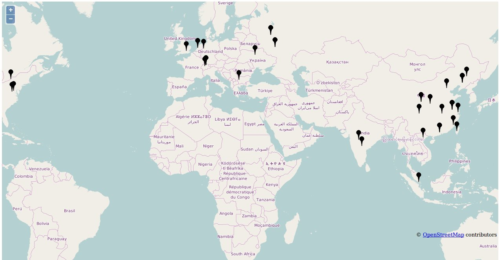

#FAIL2BAN-MAPPER

## Synopsis

Fail2ban-Mapper will plot a world map of IP's banned by Fail2ban and save it as an HTML file. Best run with daily Cron job. 

## To compile:

make f2bmap

## Screenshot

## License

Copyright 2015-16, Matthew Wilson. 
License GPLv3+: GNU GPL version 3 or later http://gnu.org/licenses/gpl.html.
No warranty. Software provided as is.
Uses OpenLayers JS API in html map files, under BSD 2-Clause License, (c) OpenLayers Contributors.
