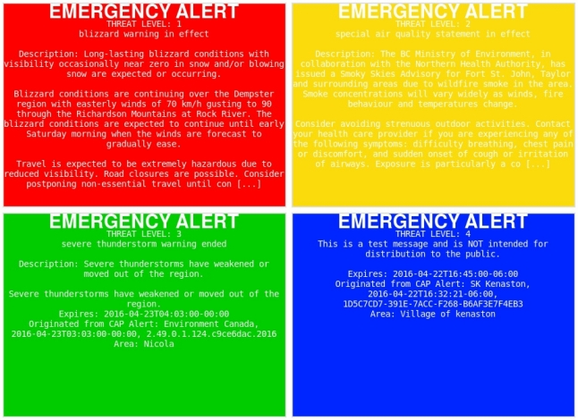

# threat level (tl) v 0.2

## Synopsis

threat level is an aggregator of public alert messages (weather, safety, civil defense, etc). This will parse any RSS-XML feed using the [Common Alerting Protocol](http://docs.oasis-open.org/emergency/cap/v1.2/CAP-v1.2-os.html). A numerical threat level (1-4) is determined by severity of the parsed event. Attractive images are automatically generated by ImageMagick. The images are in-part based on the alert [broadcasting guidelines](http://www.publicsafety.gc.ca/cnt/mrgnc-mngmnt/mrgnc-prprdnss/npas/clf-lng-eng.aspx) provided by Public Safety Canada. Coloring corresponds to the threat level of the alert. Alerts XML feed provided by [Pelmorex](https://alerts.pelmorex.com).

## Options
 
tl \[list current alert items\]

tl -i \(generate alert images\)

tl -d \(download new xml file\)

tl -c \(create custom image\)

tl -s [1] [2] [3] [4] \(only use these individual levels\)

## Files
./thefile.xml - downloaded xml file for parsing.

## Requirements

libxml2, libxml2-dev, libcurl3 and libcurl3-dev are required to compile. ImageMagick also required to generate images.

To compile: 
make install

or

gcc -o tl main.c curl.c imggen.c -I/usr/include/libxml2 -lxml2 -lm -lcurl

## Screenshot

## License

Copyright 2016, Matthew Wilson. 
License GPLv3+: GNU GPL version 3 or later http://gnu.org/licenses/gpl.html.
No warranty. Software provided as is.
